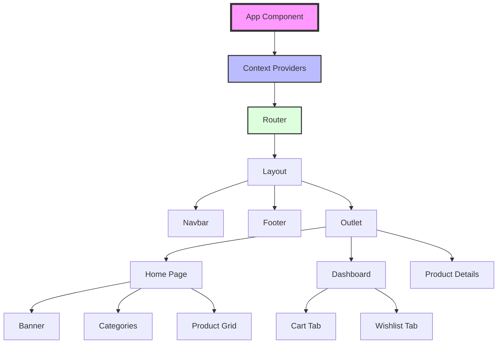

# 🚀 GadgetHeaven - Modern E-commerce Platform

[](https://github.com/programming-hero-web-course-4/b10a8-gadget-heaven-TheToriqul)


## 📋 Overview

GadgetHeaven is a modern e-commerce platform I developed to create an engaging shopping experience for tech enthusiasts. This project represents my journey in mastering React.js and modern web development practices. Through building this application, I've implemented complex state management, responsive design patterns, and intuitive user interfaces.

## 🏗 Technical Architecture

The application follows a component-based architecture with Context API for state management and React Router for navigation.



## 💻 Technical Stack

- **Frontend:**
  - React.js with React Router DOM
  - Tailwind CSS for styling
  - Context API for state management
  - React Hot Toast for notifications

- **State Management:**
  - Context API for global state
  - LocalStorage for data persistence
  - Custom hooks for state logic

- **Development Tools:**
  - Vite for build tooling
  - ESLint for code quality
  - Prettier for code formatting

## ⭐ Key Features

1. **Dynamic Product Management**
   - Category-based filtering
   - Responsive product grid
   - Detailed product pages

2. **Shopping Experience**
   - Shopping cart with price tracking
   - Wishlist functionality
   - Price-based sorting

3. **User Interface**
   - Responsive design
   - Interactive navigation
   - Toast notifications
   - Dynamic page titles

4. **State Management**
   - Cart total calculation
   - Price limit enforcement ($1000)
   - Persistent storage

5. **Navigation System**
   - Category-based routing
   - Protected routes
   - Dynamic breadcrumbs

## 📚 Learning Journey

### Technical Mastery:

1. **Advanced React Patterns**
   - Context API implementation
   - Custom hooks development
   - Component composition

2. **State Management**
   - Global state architecture
   - LocalStorage integration
   - State persistence strategies

3. **Routing & Navigation**
   - Dynamic routing
   - Protected routes
   - Navigation guards

4. **UI/UX Development**
   - Responsive design principles
   - Component-based architecture
   - Animation integration

5. **Performance Optimization**
   - Code splitting
   - Lazy loading
   - Resource optimization

### Professional Development:

1. Project architecture planning
2. Code organization and documentation
3. Problem-solving and debugging
4. User experience optimization
5. Performance monitoring

## 🔄 Future Enhancements

<details>
<summary>View Planned Improvements</summary>

1. User authentication system
2. Payment gateway integration
3. Advanced filtering options
4. Review and rating system
5. Admin dashboard
6. Order tracking system
</details>

## ⚙️ Installation

<details>
<summary>View Installation Details</summary>

### Prerequisites

- Node.js (v14 or higher)
- npm or yarn
- Git

### Setup Steps

1. Clone the repository:
```bash
git clone https://github.com/programming-hero-web-course-4/b10a8-gadget-heaven-TheToriqul
```

2. Install dependencies:
```bash
cd gadget-heaven
npm install
```

3. Start development server:
```bash
npm run dev
```

</details>

## 📫 Contact

- 📧 Email: toriqul.int@gmail.com
- 📱 Phone: +65 8936 7705, +8801765 939006

## 🔗 Project Links

- [GitHub Repository](https://github.com/programming-hero-web-course-4/b10a8-gadget-heaven-TheToriqul)
- [Live Demo](https://ph-gadget-heaven.netlify.app/)

## 👏 Acknowledgments

- [Programming Hero](https://web.programming-hero.com/)
- React.js community for invaluable resources
- Tailwind CSS team for amazing documentation
- Fellow developers for feedback and support

---

Feel free to explore, modify, and build upon this configuration as part of my learning journey. You're also welcome to learn from it, and I wish you the best of luck!